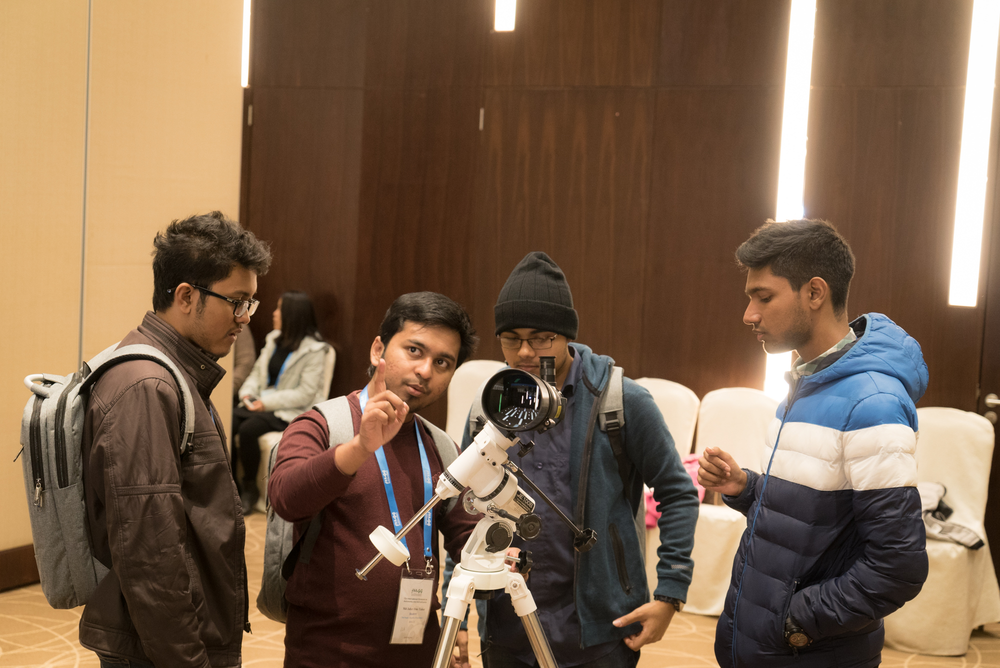
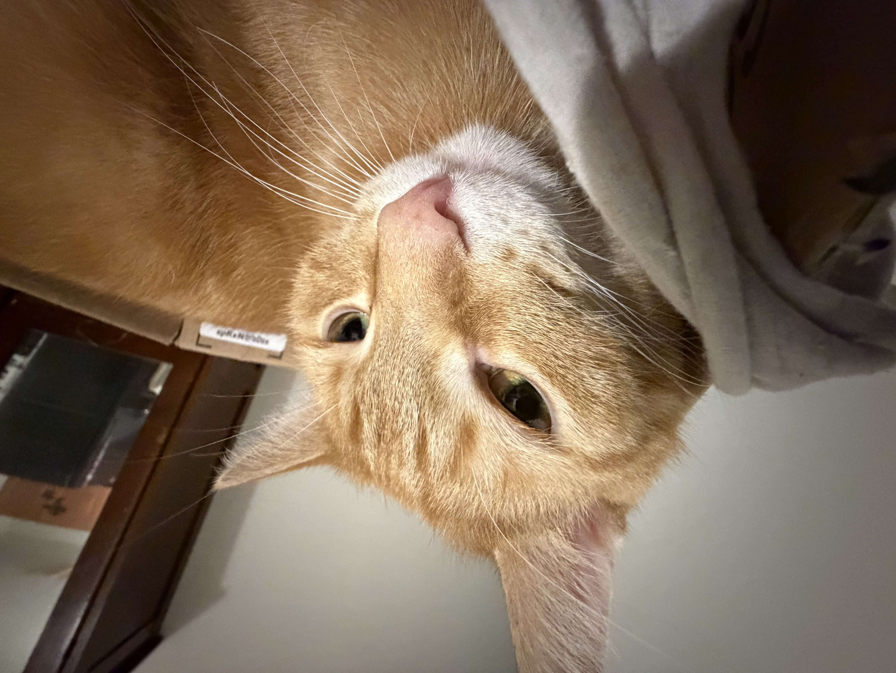

## Books

I owe my reading habit to **Douglas Adams**—both The Hitchhiker’s Guide to the Galaxy _(the “trilogy in five parts”)_ and Dirk Gently. 

I’m slowly downloading audiobooks:

- [Douglas Adams] The Hitchhiker's Guide to the Galaxy (trilogy of five) - read by the main man himself.
- [Terry Pratchett] Discworld Series (41 novels) - performed by Nigel Planer (personal favorite) and Stephen Briggs.
- [P. G. Woodehouse] The Inimitable Jeeves -  ''
- [Robert Sheckley] Dimension of Miracles -   performed by John Hodgman
- [Kurt Vonnegut] Sirens of Titan - performed by ...

more to be added ...

## Earlier threads

::: {.pair}
::: {.pair-text}
I was active with [BDOAA](https://bdoaa.org) and represented Bangladesh at IOAA 2018. 
It was a lot of night skies, problem sets, and lifelong friends. Good ol' times.
:::

::: {.pair-media}

:::
:::

### Also Meet Heidi

::: {.pair}
::: {.pair-text}
the derpy, alien cat.
:::

::: {.pair-media}

:::
:::

##### Other than those, I prefer long walks along lakeshore, beaches, parks and the lanes of intrusive thoughts.
